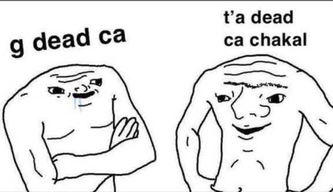

La gauche et le principe de trahison semblent avoir une longue histoire. Les groupes plus ou moins radicaux se lancent le terme au visage sans trop d'hésitations. Ils s'auto-convainquent que leur vision est la seule légitime et que celle de autres n'est pas la bonne. Et par conséquent, les autres trahissent la confiance des citoyens qui les ont élus. Je ne peux pas parler du passé, mais en 2025, je ne pense pas être le seul à penser la chose suivante : toute la gauche trahie. Pas seulement le Parti Socialiste, les Écologistes, La France Insoumise ou le Parti Communiste, mais tous.

Ils trahissent leurs électeur·rices, car ils n'arrivent pas à tomber d'accord sur des détails. Il est bien normal et souhaitable de ne pas être d'accord et de discuter des modalités de mises en place d'un projet de transition écologiques pour la France. Mais il est seulement possible de le faire si cette idée est acceptable (et acceptée) dans le débat public. Or, vous savez qui ne veut pas aborder ce sujet ? Oui, la droite (pour ce qui en reste) et l'extrême droite. Et vous savez qui profite d'un déchirement de la gauche large, qui ne fait pas front commun ? Bravo, c'est bien les mêmes. Et pour une meilleure répartition des richesses ? Pour des politiques sociales plus juste et humaines ? Pareil.

Voilà pourquoi je pense que toute la gauche trahie. Par ambition politique et/ou présidentiel, elle laisse de la place à l'extrême droite. Elle laisse des scénarios dramatiques pour notre pays devenir chaque jour plus probable. Elle laisse la France suivre tranquillement le même chemin que celui déjà parcouru par d'autres pays comme l'Italie, la Pologne, la République tchèque ou plus spectaculairement les États-Unis.

Bref, la gauche trahie parce qu'elle ne fait pas front commun. 

Ce n'est pas l'analyse la plus fine qui soit, mais si je dois choisir, je préfère débattre avec des membres de la GDR plutôt que du RN. J'aimerais, surtout, pouvoir voter pour un parti ou une alliance ayant une réelle chance de passer le premier tour d'une élection présidentiel. Et je suis persuadé qu'à l'image du Nouveau Front Populaire de 2024, il y a une vraie volonté des électeur·rices de gauche de pouvoir s'attacher à un programme commun (même si les détails de celui-ci doivent être débattus plus tard, après une victoire par exemple).

(Mais pas d'inquiétude, je voterai pour tonton Méluche s'il le faut).